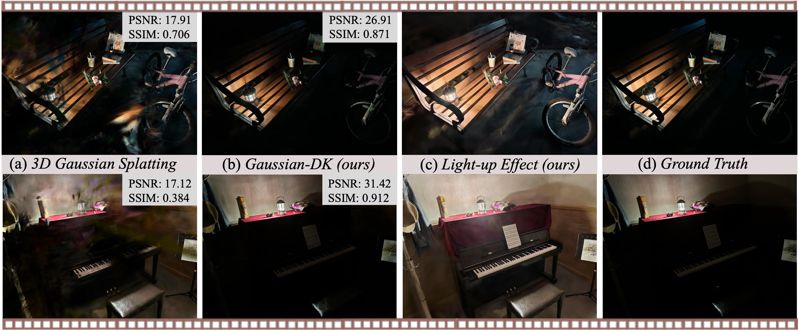

# Gaussian in the Dark 😈

This repository contains the official authors implementation associated with the paper "Gaussian in the Dark: Real-Time View Synthesis From Inconsistent Dark Images Using Gaussian Splatting", which has been accepted by **Pacific Graphics 2024** (journal track).



## Requirements

* Linux OS
* NVIDIA GPUs. We experimented on A6000 GPUs (cuda 11.8).
* Python libraries: see [environment.yml](./environment.yml). You can use the following commands with Anaconda3 to create and activate your virtual environment:
  - `git clone https://github.com/yec22/Gaussian-DK.git`
  - `cd Gaussian-DK`
  - `conda env create -f environment.yml`
  - `conda activate 3dgs_dk`

## Dataset

To facilitate further research on novel view synthesis in dark conditions, we propose a **new challenging dataset** containing 12 real-world scenes (5 indoors and 7 outdoors). Each scene consists of approximately 80 to 130 regular format images.

The proposed dataset can be downloaded from [here](https://pan.baidu.com/s/1xmZqYEJ5ZMkdldPS9_MgiQ?pwd=jf48) (~13G).

## Usage

First, please make sure that all requirements are satisfied.
Then, following the scripts below to train, render, and evaluate.

```
# Train with train/test split
python train.py -r 4 -s datasets/dark/piano -m output/piano --port 1111 --eval

# Generate renderings
python render.py -m output/piano

# Compute metrics on renderings
python metrics.py -m output/piano

# More visualization
python render_spherify.py -m output/piano
```

## Results

**Comparison with 3DGS**


**Light-Up Effect**


## Acknowledgement

Code of this repo is rely on [3DGS](https://github.com/graphdeco-inria/gaussian-splatting) and [HDR-NeRF](https://github.com/xhuangcv/hdr-nerf/). We thank the authors for their great job!